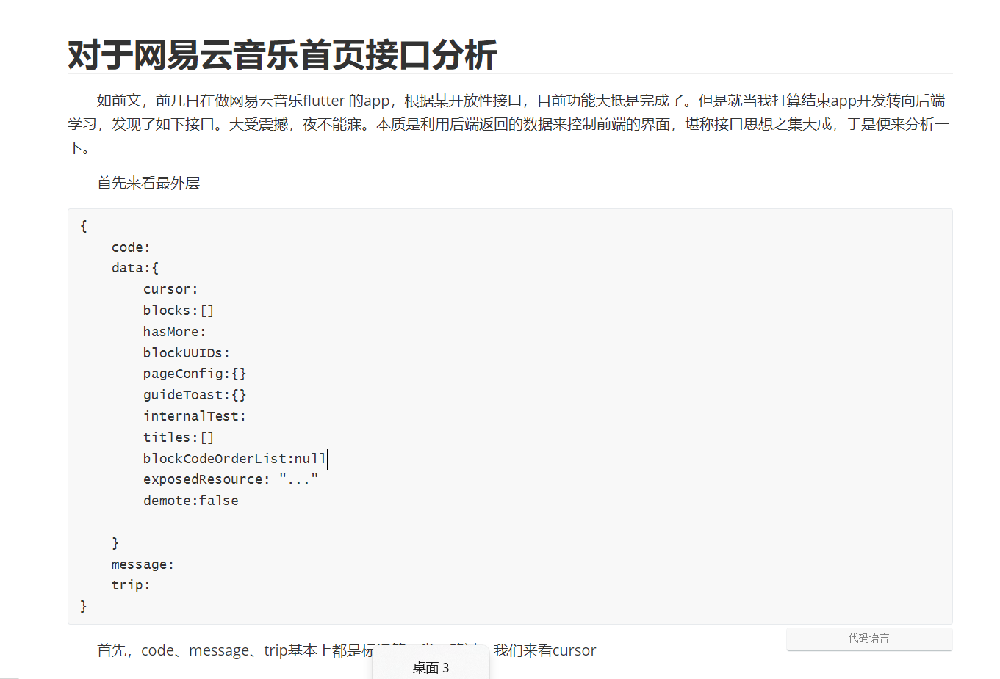
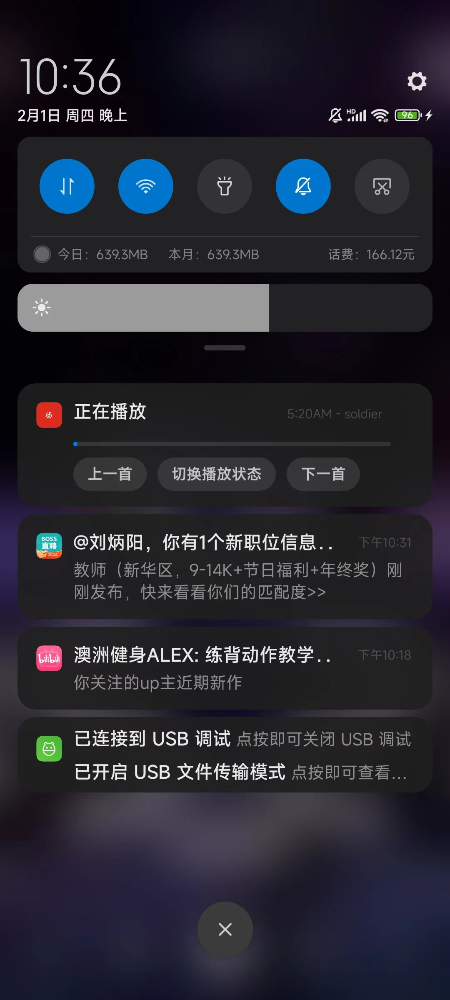
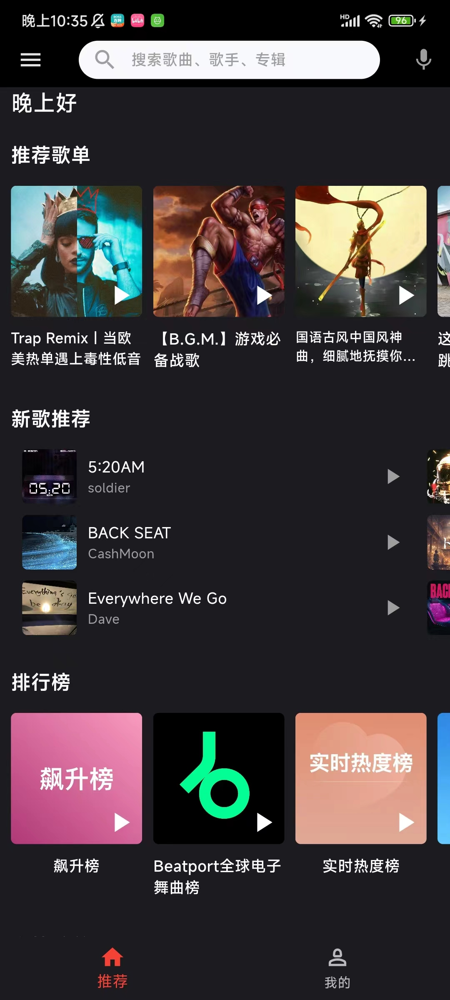
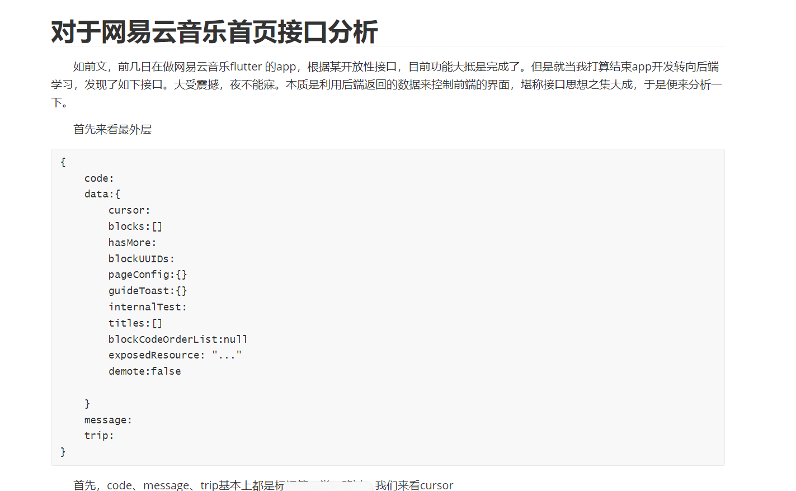
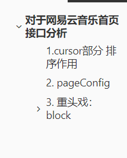

# wyyapp

A new Flutter project.

具体演示等可看个人博客： https://holdme.fun/2024/02/01/3wyyapp/

## Getting Started

一个简陋版的仿网易云音乐app，供学习使用
开发实践
1.17-2.1 一共十五天，中间休息了三天
经历了大大小小四五次重构，原本的代码写的太烂了
网易云接口是适配pc端的，对于android端的适配不是很好，所以有些功能实现起来非常复杂
不过的确有app端的首页接口，但是其内部结构过于复杂,尝试分析，明白了大部分接口的含义
然而，嵌套起来实在太过复杂

所以只做了核心功能
歌曲类的封装，包括下载、下一首、重新播放等功能
下载类的封装、通知类的封装

可以说,封装、整理、以及称得上是舒爽的代码结构是我在这个项目中学到的最有价值的东西

## 项目截图

下载功能

通过android 的notification实现下载进度的展示 以及播放的控制

[notification.mp4](source/notificationAmusiclist.mp4)

搜索

深色模式

歌单广场

批量管理
[playlist](source/addtoplaylist.mp4)

以下是对于网易云音乐接口的分析的一角，总的来说
对我启发的最重要的点是
他们通过后端来控制前端代码的展示结构，这样的代码我第一次见到

初见时候，不禁又对前端的作用心生鄙夷
后面尝试复现前端的实现类的时候
才发现，这样的组织结构，对于前端来说,是非常不友好的
至少对一个未从头参与开发的初级学习者来说是这样的

